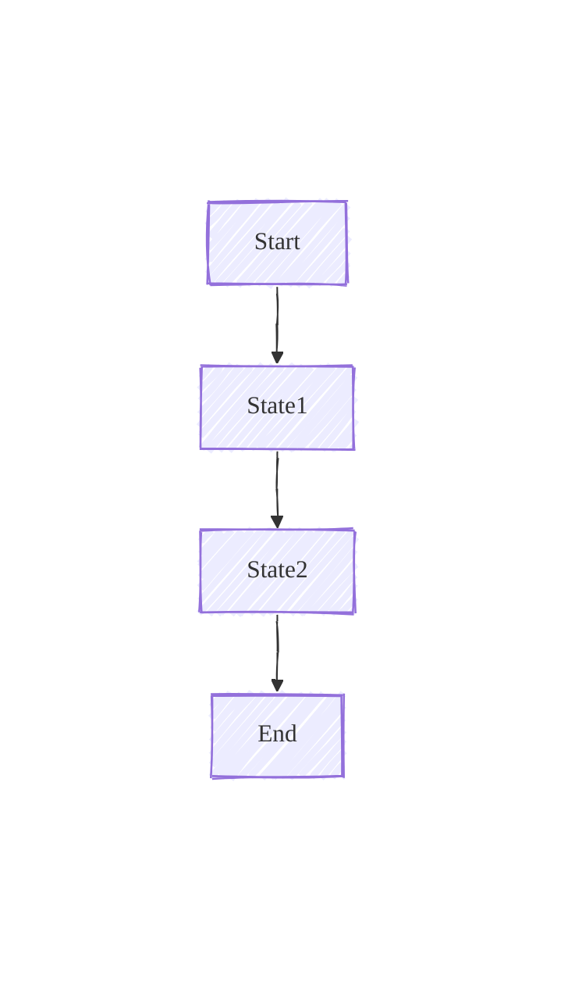

# Mermaid GitHub Safe-Area

Use this skill when editing Mermaid diagrams for GitHub README rendering to prevent the bottom-right navigation/zoom controls from overlapping diagram content, using only `%%{init: ...}%%` configuration.

## Constants
- `CONTROLS_HEIGHT_PX = 110`
- `BUFFER_PX = 20`
- `SAFE_PX = 130`

Use `SAFE_PX` as the minimum safe-area value.

## Style keyword support: "handrawn style"
If the user asks for "handrawn style" or "hand drawn style":
- Always set a handwritten-style font stack via top-level `fontFamily`:
  - `fontFamily = "virgil, excalifont, segoe print, bradley hand, chalkboard se, marker felt, comic sans ms, cursive"`
- For flowcharts (and other supported types), also set `look = "handDrawn"`.
- For sequence diagrams, do not set `look` (ignored/not supported there); rely on `fontFamily` only.

## Rules
- The first non-empty line of every Mermaid block must be a valid init directive: `%%{init: { ...valid JSON... }}%%`.
- JSON booleans must be `true/false`, not quoted strings.
- Do not use spacer nodes or CSS; only Mermaid init config.

### Flowcharts
- Ensure `flowchart.diagramPadding >= SAFE_PX` (default `130`).
- This pads all sides; accept the tradeoff to avoid spacers/CSS.

Default example:


Handrawn style example:


### Sequence diagrams
- Ensure `sequence.diagramMarginX >= SAFE_PX` (protects right side).
- Ensure `sequence.bottomMarginAdj >= SAFE_PX` (protects bottom).
- Keep `sequence.diagramMarginY` modest (20-40). If missing, set to `30`.

Default example:


Handrawn style example:


## Merging existing init directives
When an init directive already exists:
1. Parse the JSON.
2. Preserve unrelated keys.
3. Apply minimums by taking `max(existing, SAFE_PX)`.
4. If the user requested handrawn style, apply the style settings described above.

Merge rules:
- Flowchart: `flowchart.diagramPadding = max(existing, SAFE_PX)`.
- Sequence: `sequence.diagramMarginX = max(existing, SAFE_PX)` and `sequence.bottomMarginAdj = max(existing, SAFE_PX)`.
- If `sequence.diagramMarginY` is missing, set it to `30`.
- If handrawn style is requested:
  - Flowchart: set `look = "handDrawn"` and `fontFamily = <handwritten font stack>`.
  - Sequence: set `fontFamily = <handwritten font stack>` and do not set `look`.

Pseudocode:
```text
SAFE_PX = 130
HAND_FONT = "virgil, excalifont, segoe print, bradley hand, chalkboard se, marker felt, comic sans ms, cursive"

if diagram_type == "flowchart":
    init.flowchart.diagramPadding = max(init.flowchart.diagramPadding or 0, SAFE_PX)
    if wants_handrawn_style:
        init.look = "handDrawn"
        init.fontFamily = HAND_FONT

if diagram_type == "sequenceDiagram":
    init.sequence.diagramMarginX  = max(init.sequence.diagramMarginX  or 0, SAFE_PX)
    init.sequence.bottomMarginAdj = max(init.sequence.bottomMarginAdj or 0, SAFE_PX)
    if init.sequence.diagramMarginY is missing:
        init.sequence.diagramMarginY = 30
    if wants_handrawn_style:
        init.fontFamily = HAND_FONT
```

## Tuning guidance
- If overlap persists, increase `SAFE_PX` by +20 to +60.
- Prefer increasing:
  - Flowcharts: `flowchart.diagramPadding`
  - Sequence: `sequence.bottomMarginAdj` first, then `sequence.diagramMarginX`

## Quick reference
- Flowchart (safe area): `%%{init: {"flowchart": {"diagramPadding": 130}}}%%`
- Sequence (safe area): `%%{init: {"sequence": {"diagramMarginX": 130, "bottomMarginAdj": 130}}}%%`
- Handrawn style keyword:
  - Flowchart: add `look:"handDrawn"` plus `fontFamily:<stack>`
  - Sequence: add `fontFamily:<stack>` only
